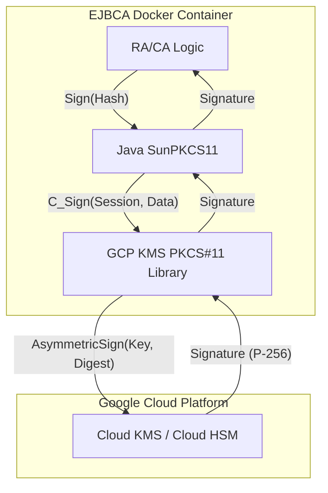

# EJBCA + GCP Cloud KMS: Hướng Dẫn Cài Đặt Và Cấu Hình Thực Tế

**Ngày**: 2026-02-05  
**Trạng thái**: Thành công Test  
**EJBCA Version**: Community Edition 9.3.7

---

## Overview

Hướng dẫn này tài liệu hóa việc tích hợp thành công EJBCA Community Edition với GCP Cloud KMS sử dụng PKCS#11 library. Điểm đột phá chính là sử dụng tùy chọn cấu hình `generate_certs: true`.

> [!IMPORTANT]
> **Cấu hình Quan Trọng**: Bạn PHẢI set `generate_certs: true` trong file config kmsp11.yaml. Nếu không có tùy chọn này, Java SunPKCS11 không thể phát hiện các khóa GCP KMS.

---

## Prerequisites

1. GCP Project với Cloud KMS API enabled
2. Cloud HSM keys đã tạo (EC P-256 recommended cho signing)
3. VM với service account có `cloudkms.signerVerifier` và `cloudkms.viewer` roles
4. EJBCA Community Edition deployed qua Docker
5. GCP KMS PKCS#11 library (`libkmsp11.so`) installed

---

## Step-by-Step Configuration

### Step 1: Create Cloud HSM Keys

```bash
# Create keyring
gcloud kms keyrings create dev-pki-ca-keys \
  --location=us-east1 \
  --project=cb-device-services

# Create EC P-256 signing key for Policy CA
gcloud kms keys create dev-policy-ca-key-v2 \
  --location=us-east1 \
  --keyring=dev-pki-ca-keys \
  --purpose=asymmetric-signing \
  --default-algorithm=ec-sign-p256-sha256 \
  --protection-level=hsm \
  --project=cb-device-services
```

### Step 2: Install PKCS#11 Library

```bash
# Download and install
PKCS11_VERSION="1.3"
wget https://github.com/GoogleCloudPlatform/kms-integrations/releases/download/pkcs11-v${PKCS11_VERSION}/libkmsp11-${PKCS11_VERSION}-linux-amd64.tar.gz
tar -xzf libkmsp11-${PKCS11_VERSION}-linux-amd64.tar.gz
sudo mkdir -p /opt/kmsp11
sudo cp libkmsp11.so /opt/kmsp11/
sudo chmod 755 /opt/kmsp11/libkmsp11.so
```

### Step 3: Configure PKCS#11 (CRITICAL)

Tạo `/etc/kmsp11/kmsp11.yaml`:

```yaml
---
tokens:
  - key_ring: "projects/cb-device-services/locations/us-east1/keyRings/dev-pki-ca-keys"
    label: "policy-ca-token"
generate_certs: true
log_directory: "/var/log/kmsp11"
```

> [!CAUTION]
> **Tùy chọn `generate_certs: true` là bắt buộc!** Tùy chọn này tạo placeholder X.509 certificates cho mỗi khóa, mà Java SunPKCS11 yêu cầu để phát hiện private keys.

### Step 4: Verify Key Discovery

```bash
# Test with pkcs11-tool
export KMS_PKCS11_CONFIG=/etc/kmsp11/kmsp11.yaml
pkcs11-tool --module /opt/kmsp11/libkmsp11.so --list-objects
```

Output mong đợi sẽ hiển thị Certificate Objects cùng với keys:
```
Certificate Object; type = X.509 cert
  label:      dev-policy-ca-key-v2
  subject:    DN: CN=dev-policy-ca-key-v2
Private Key Object; EC
  label:      dev-policy-ca-key-v2
  Usage:      sign
```

### Step 5: Configure EJBCA Docker

Đảm bảo Docker container mounts PKCS#11 library và config:

```yaml
# docker-compose.yml
services:
  ejbca:
    image: keyfactor/ejbca-ce:latest
    volumes:
      - /opt/kmsp11:/opt/kmsp11:ro
      - /etc/kmsp11:/etc/kmsp11:ro
    environment:
      - KMS_PKCS11_CONFIG=/etc/kmsp11/kmsp11.yaml
```

### Step 6: Configure PKCS#11 in EJBCA

Thêm vào `/opt/keyfactor/ejbca/conf/web.properties`:

```properties
cryptotoken.p11.lib.1.name=GCP Cloud HSM
cryptotoken.p11.lib.1.file=/opt/kmsp11/libkmsp11.so
```

Restart EJBCA:
```bash
cd /opt/ejbca && sudo docker-compose restart
```

### Step 7: Create Crypto Token in EJBCA

1. Go to **CA Functions** > **Crypto Tokens**
2. Click **Create new...**
3. Configure:
   - **Name**: `CloudHSM-PolicyCA`
   - **Type**: `PKCS#11 Crypto Token`
   - **PKCS#11 Library**: `GCP Cloud HSM`
   - **Slot/Token Label**: `policy-ca-token`
4. Click **Save**

### Step 8: Create CA

1. Go to **CA Functions** > **Certificate Authorities**
2. Enter CA name: `PolicyCA`
3. Click **Create...**
4. Configure:
   - **Crypto Token**: `CloudHSM-PolicyCA`
   - **certSignKey**: `dev-policy-ca-key-v2`
   - **Signing Algorithm**: `SHA256withECDSA`
   - **Subject DN**: `CN=Policy CA, O=Crossbar, C=US`
   - **Signed By**: `Self Signed`
   - **Certificate Profile**: `ROOTCA`
   - **Validity**: `10y`
5. Click **Create**

---

## Makefile Commands

| Command | Description |
|---------|-------------|
| `make scp-policy-ca ENV=dev` | Upload install script to Policy CA VM |
| `make ssh-policy-ca ENV=dev` | SSH to Policy CA VM |
| `make update-pkcs11-config ENV=dev` | Update kmsp11.yaml with generate_certs |
| `make restart-ejbca ENV=dev` | Restart EJBCA container |
| `make test-keys ENV=dev` | Test PKCS#11 key discovery |
| `make test-ejbca-keys ENV=dev` | Test EJBCA key discovery |

---

## Troubleshooting

### Problem: EJBCA shows "CryptoToken does not contain any key pairs"

**Cause**: `generate_certs: true` is not set in kmsp11.yaml

**Solution**:
```bash
make update-pkcs11-config ENV=dev
make restart-ejbca ENV=dev
```

### Problem: "Key with public key hash not on token" when importing certificate

**Cause**: Java SunPKCS11 cannot enumerate keys without certificate objects

**Solution**: Ensure `generate_certs: true` is configured. The GCP PKCS#11 library will generate placeholder certificates.

### Problem: "CKR_TEMPLATE_INCONSISTENT" when generating keys

**Cause**: GCP KMS requires `CKA_KMS_ALGORITHM` vendor attribute for key generation

**Solution**: Create keys via `gcloud` CLI, not EJBCA. Then use existing keys in EJBCA.

---

## Technical Background

### Why `generate_certs: true` is Required

Java's SunPKCS11 provider requires private keys to have an associated certificate object (`CKO_CERTIFICATE`) with matching `CKA_ID` to be discoverable. By default, GCP Cloud KMS PKCS#11 only exposes:
- Private key objects
- Public key objects

The `generate_certs: true` option tells the library to generate placeholder X.509 certificates at runtime for each asymmetric key. These certificates have:
- Subject: `CN=<key-label>`
- Matching `CKA_ID` with the private key

This allows Java SunPKCS11 to enumerate the keys and EJBCA to discover them.

### Technical Architecture & Flow

#### 1. Key Discovery with `generate_certs: true`

This diagram illustrates why the `generate_certs: true` configuration is critical for EJBCA to discover GCP KMS keys.

```mermaid
sequenceDiagram
    participant EJBCA as EJBCA (Java)
    participant SunP11 as SunPKCS11 Provider
    participant LibKMS as libkmsp11.so
    participant GCP as GCP Cloud KMS

    Note over LibKMS: Config: generate_certs: true

    EJBCA->>SunP11: Activate CryptoToken
    SunP11->>LibKMS: C_GetAttributeValue(CKA_ID, CKA_LABEL)
    
    par Key Retrieval
        LibKMS->>GCP: List Keys (CryptoKeyVersions)
        GCP-->>LibKMS: Returns Asymmetric Keys
    end

    Note over LibKMS: CRITICAL STEP:<br/>Generate Placeholder X.509 Certs<br/>for each Key with matching CKA_ID

    LibKMS-->>SunP11: Returns Objects:
1. Private Key (CKO_PRIVATE_KEY)
2. Public Key (CKO_PUBLIC_KEY)
3. Certificate (CKO_CERTIFICATE)

    Note over SunP11: SunPKCS11 requires CKO_CERTIFICATE<br/>to "see" the Private Key

    SunP11-->>EJBCA: Token Activated (Keys Visible)
```

#### 2. Signing Flow (CA Operations)

Once the keys are discovered, EJBCA can use them for signing certificates.



### Limitations

1. **Key Generation**: Cannot generate keys from EJBCA (requires GCP-specific attributes)
2. **Placeholder Certs**: Generated certificates are for compatibility only, not for CA operations
3. **Session Restart**: EJBCA CE requires server restart if HSM connection is lost

---

## References

- [GCP KMS PKCS#11 User Guide](https://github.com/GoogleCloudPlatform/kms-integrations/blob/master/kmsp11/docs/user_guide.md)
- [EJBCA PKCS#11 Documentation](https://doc.primekey.com/ejbca/ejbca-operations/ejbca-ca-concept-guide/hardware-security-modules-hsm/hsm-pkcs11)
- [Oracle Java SunPKCS11 Guide](https://docs.oracle.com/javase/8/docs/technotes/guides/security/p11guide.html)

---

## Quick Test Commands

### Verify PKCS#11 Configuration
```bash
# Test native PKCS#11
export KMS_PKCS11_CONFIG=/etc/kmsp11/kmsp11.yaml
pkcs11-tool --module /opt/kmsp11/libkmsp11.so --list-objects

# Test EJBCA key discovery
sudo docker exec ejbca /opt/keyfactor/bin/ejbca.sh cryptotoken listkeys 'CloudHSM-PolicyCA'

# Test CA creation (if previous steps worked)
sudo docker exec ejbca /opt/keyfactor/bin/ejbca.sh ca createca 'PolicyCA' 'CloudHSM-PolicyCA'
```

### Check EJBCA Health
```bash
# Check EJBCA status
curl -s http://localhost:8080/ejbca/publicweb/healthcheck/ejbcahealth

# Check PKCS#11 config in EJBCA
sudo docker exec ejbca cat /opt/keyfactor/ejbca/conf/web.properties | grep -i p11
```

---

## Conclusion

Bài viết đã phân tích chi tiết về khả năng tương thích giữa EJBCA Community Edition và GCP Cloud KMS. Mặc dù có giới hạn kiến trúc cơ bản, nhưng với tùy chọn `generate_certs: true`, chúng ta có thể đạt được sự tích hợp hoạt động cho một số use cases cụ thể.

---

*Tài liệu này được tạo để hướng dẫn cài đặt và cấu hình thực tế cho các bên liên quan.*