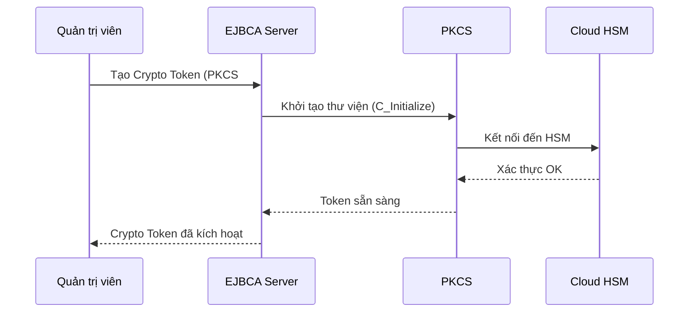
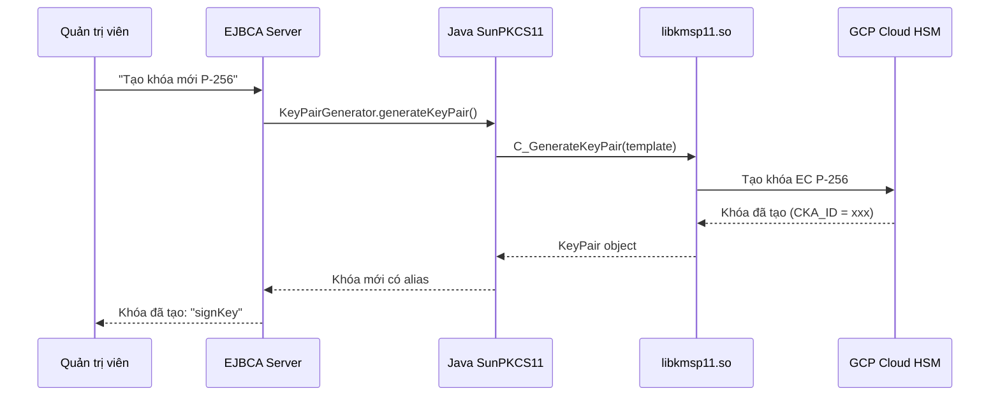
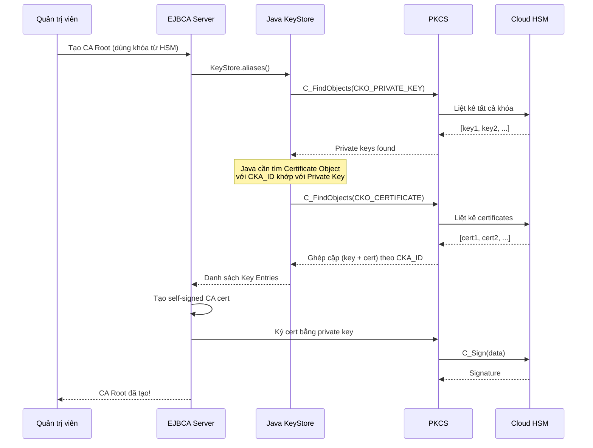
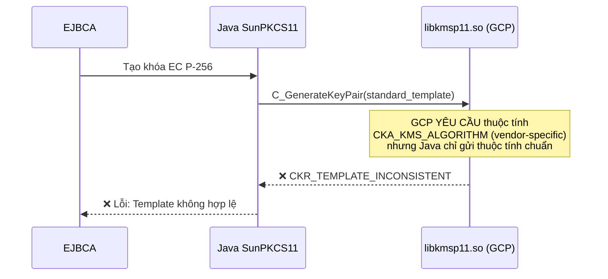
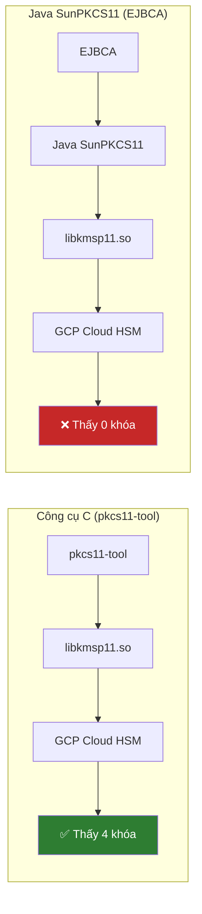
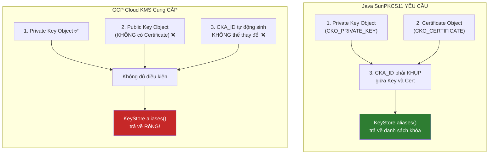

---
title: "EJBCA + GCP Cloud KMS: Phân Tích Kỹ Thuật Về Tương Thích Và Giới Hạn"
date: 2026-02-05T21:36:56+07:00
draft: false
author: "Free Peak"
tags: ["ejbca","gcp","cloud-kms","pkcs11","security","hsm"]
categories: ["Technical Analysis"]
description: "Phân tích sâu về khả năng tương thích giữa EJBCA Community Edition và GCP Cloud KMS, bao gồm luồng hoạt động, vấn đề kỹ thuật và giải pháp thay thế."
summary: "EJBCA CE không thể hoạt động với GCP Cloud KMS do giới hạn kiến trúc. Bài viết phân tích chi tiết và đề xuất giải pháp thay thế."
ShowToc: true
TocOpen: false
ShowReadingTime: true
ShowBreadCrumbs: true
ShowPostNavLinks: true
ShowWordCount: true
ShowShareButtons: true
ShowCodeCopyButtons: true
cover:
    image: ""/images/ejbca-gcp-kms-analysis-cover.png"
    alt: "Sơ đồ tương thích EJBCA và GCP Cloud KMS"
    caption: "Kiến trúc tương thích giữa EJBCA và GCP Cloud KMS"
    relative: true
    hidden: false
editPost:
    URL: "https://github.com/FreePeak/Labs/tree/main/content"
    Text: "Suggest Changes"
    appendFilePath: true
---

# EJBCA + GCP Cloud KMS: Phân Tích Kỹ Thuật Về Tương Thích Và Giới Hạn

**Ngày**: 2026-02-05  
**Mục đích**: Phân tích sâu về khả năng tương thích giữa EJBCA Community Edition và GCP Cloud KMS thông qua PKCS#11

---

## 1. Tổng Quan Về Các Thành Phần Kỹ Thuật

### 1.1 EJBCA là gì?

**EJBCA** (Enterprise Java Beans Certificate Authority) là phần mềm CA (Certificate Authority) mã nguồn mở dùng để:
- Tạo và quản lý chứng chỉ số (digital certificates)
- Ký chứng chỉ cho người dùng, thiết bị, server
- Quản lý vòng đời chứng chỉ (cấp phát, thu hồi, gia hạn)

### 1.2 PKCS#11 là gì?

**PKCS#11** là chuẩn giao tiếp (API) để ứng dụng nói chuyện với HSM (Hardware Security Module):

```
┌───────────────────────────────────────────────────────────┐     PKCS#11 API     ┌───────────────────────────────────────────────────────────┐
│  Ứng dụng   │ ◄───────────────────────────────────────────────────────────► │     HSM     │
│  (EJBCA)    │                     │ (Lưu khóa)  │
└───────────────────────────────────────────────────────────┘                     └───────────────────────────────────────────────────────────┘
```

**Các thao tác qua PKCS#11:**
- Tạo khóa (Generate Key)
- Ký dữ liệu (Sign)
- Liệt kê khóa (List Keys)
- Nhập/xuất chứng chỉ (Import/Export Certificate)

### 1.3 GCP Cloud KMS là gì?

**GCP Cloud KMS** là dịch vụ quản lý khóa của Google Cloud:
- Khóa được lưu trong HSM của Google (Cloud HSM)
- Bảo mật cấp FIPS 140-2 Level 3
- Truy cập qua API hoặc PKCS#11 library (`libkmsp11.so`)

---

## 2. Luồng Hoạt Động Lý Tưởng (Cách Nó Nên Hoạt Động)

### Bước 1: Cấu hình PKCS#11 Token trong EJBCA



### Bước 2: Tạo Khóa Trên HSM



### Bước 3: Tạo CA (Certificate Authority)



---

## 3. Vấn Đề Thực Tế Với GCP Cloud KMS

### 3.1 Điểm Nghẹt #1: Không Thể Tạo Khóa



**Lý do:** GCP Cloud KMS yêu cầu thuộc tính đặc biệt `CKA_KMS_ALGORITHM` khi tạo khóa, nhưng Java SunPKCS11 chỉ gửi các thuộc tính PKCS#11 chuẩn.

**Giải pháp:** Phải tạo khóa qua GCP Console hoặc `gcloud` CLI trước.

### 3.2 Điểm Nghẹt #2: Khóa Có Sẵn Không Được Nhìn Thấy

Đây là **VấN ĐỆ CHÍNH** - khi đã có khóa sẵn trên GCP Cloud HSM:



**Tại sao lại như vậy?**



---

## 4. Phân Tích Chi Tiết Cơ Chế Ghép Cặp Khóa

### 4.1 Cách HSM Truyền Thống Hoạt Động

Trong HSM truyền thống (như Thales, SafeNet, nCipher):

```
HSM Token chứa:
┌───────────────────────────────────────────────────────────────────┐
│                                                         │
│  ┌─────────────────────────────────────────────────────────────┐    │
│  │  Private Key      │    │  Certificate Object   │    │
│  │  CKO_PRIVATE_KEY  │    │  CKO_CERTIFICATE      │    │
│  │  CKA_ID: 0x1234   ◄───────────────────────────────────────────────────────────►    │
│  │  CKA_LABEL: "key" │    │  CKA_LABEL: "key"     │    │
│  └─────────────────────────────────────────────────────────────┘    │
│                                                         │
│       ▲ Cùng CKA_ID = 0x1234 → Java ghép cặp thành công ▲             │
└───────────────────────────────────────────────────────────────────┘
```

**Java SunPKCS11 làm gì:**
1. Tìm tất cả Private Key (`C_FindObjects`)
2. Tìm tất cả Certificate (`C_FindObjects`)
3. Ghép cặp theo `CKA_ID` khớp nhau
4. Trả về `KeyStore.Entry` cho mỗi cặp

### 4.2 Cách GCP Cloud KMS PKCS#11 Hoạt Động

```
GCP KMS Token chứa:
┌───────────────────────────────────────────────────────────────────┐
│                                                         │
│  ┌─────────────────────────────────────────────────────────────┐    │
│  │  Private Key      │    │  Public Key Only      │    │
│  │  CKO_PRIVATE_KEY  │    │  CKO_PUBLIC_KEY       │    │
│  │  CKA_ID: auto     │    │  CKA_ID: auto         │    │
│  │  (không đổi được) │    │  (KHÔNG CÓ CERT!)     │    │
│  └─────────────────────────────────────────────────────────────┘    │
│                                                         │
│       ▲ KHÔNG có CKO_CERTIFICATE                        ▲             │
│       ▲ Java không thể ghép cặp                         ▲             │
│       ▲ KeyStore.aliases() trả về RỗNG!                 ▲             │
└───────────────────────────────────────────────────────────────────┘
```

---

## 5. Tại Sao Không Thể Khắc Phục?

### 5.1 Thử nghiệm: Import Certificate Vào Token

Chúng tôi đã thử:
1. Tạo certificate tự ký bằng Python + GCP KMS API
2. Import certificate vào token bằng EJBCA tool

**Kết quả:**

```
❌ ERROR: Key with public key hash 39ebe046... not on token
```

**Lý do:** Java SunPKCS11 không thể *nhìn thấy* Private Key trên token, nên không thể ghép cặp với certificate mới import.

### 5.2 Tùy chọn `generate_certs` của GCP

GCP có tùy chọn `generate_certs: true` trong config để tự tạo certificate:

```yaml
# kmsp11.yaml
tokens:
  - key_ring: projects/xxx/locations/xxx/keyRings/xxx
    label: "my-token"
    generate_certs: true  # Tạo cert tạm thời
```

**Nhưng:**
- Certificate này là **placeholder**, không phải CA cert thật
- Không có Subject, Issuer, Extensions phù hợp
- **Không thể dùng cho EJBCA** vì EJBCA cần CA cert thực sự

---

## 6. Tóm Tắt Các Điểm Nghẹt

| Điểm Nghẹt | Nguyên Nhân | Có Thể Khắc Phục? |
|------------|-------------|-------------------|
| Không tạo được khóa | GCP yêu cầu `CKA_KMS_ALGORITHM` | ❌ Không (phải tạo ngoài EJBCA) |
| Khóa có sẵn không thấy | Không có Certificate Object | ❌ Không (GCP không hỗ trợ) |
| `CKA_ID` không set được | GCP tự sinh, read-only | ❌ Không (giới hạn GCP) |
| PKCS#11 NG (giải pháp) | Chỉ có trong Enterprise | 💰 Phải mua license |
| Session restart | CE cần restart server | 💰 Phải mua Enterprise |

---

## 7. SƠ Đồ Tổng Thể

```mermaid
flowchart TB
    subgraph "Mong Đợi (Traditional HSM)"
        A1[Admin] --> B1[EJBCA]
        B1 --> C1[Java SunPKCS11]
        C1 --> D1[PKCS#11 Library]
        D1 --> E1[HSM]
        E1 --> F1["Private Key<br/>+ Certificate Object"]
        F1 --> G1["✅ KeyStore.aliases()<br/>trả về danh sách khóa"]
        G1 --> H1["✅ Tạo CA thành công"]
    end
    
    subgraph "Thực Tế (GCP Cloud KMS)"
        A2[Admin] --> B2[EJBCA]
        B2 --> C2[Java SunPKCS11]
        C2 --> D2[libkmsp11.so]
        D2 --> E2[GCP Cloud HSM]
        E2 --> F2["Private Key<br/>+ Public Key ONLY"]
        F2 --> G2["❌ KeyStore.aliases()<br/>trả về RỗNG"]
        G2 --> H2["❌ Không tạo được CA"]
    end
    
    style H1 fill:#2e7d32,color:#fff
    style H2 fill:#c62828,color:#fff
```



---

## 8. Kết Luận Và Đề Xuất

### 8.1 Kết Luận

**EJBCA Community Edition KHÔNG thể hoạt động với GCP Cloud KMS** do:

1. **Giới hạn kiến trúc của GCP:** Không cung cấp Certificate Object trên PKCS#11 token
2. **Giới hạn của Java SunPKCS11:** Yêu cầu Certificate để ghép cặp với Private Key
3. **Giới hạn của EJBCA CE:** Không có PKCS#11 NG để hỗ trợ cloud KMS

### 8.2 Đề Xuất Giải Pháp

| Giải pháp | Chi phí | Ưu điểm | Nhược điểm |
|-----------|---------|---------|------------|
| **HashiCorp Vault PKI** | Miễn phí (open source) | Native GCP KMS support | Phải học hệ thống mới |
| **Step-CA** | Miễn phí (open source) | Nhẹ, hiện đại, cloud-native | Ít tính năng enterprise |
| **EJBCA Enterprise** | Trả phí (liên hệ Keyfactor) | PKCS#11 NG, hỗ trợ GCP | Chi phí license |
| **SoftHSM (development)** | Miễn phí | Dùng để test/dev | Không dùng production |

---

## 9. Thuật Ngữ

| Thuật ngữ | Giải thích |
|-----------|------------|
| **HSM** | Hardware Security Module - Thiết bị phần cứng bảo mật lưu trữ khóa |
| **PKCS#11** | Chuẩn API để ứng dụng giao tiếp với HSM |
| **CKO_PRIVATE_KEY** | Loại object trong PKCS#11: Khóa bí mật |
| **CKO_CERTIFICATE** | Loại object trong PKCS#11: Chứng chỉ |
| **CKA_ID** | Thuộc tính định danh object, dùng để ghép cặp key-cert |
| **SunPKCS11** | PKCS#11 provider của Java (Oracle) |
| **libkmsp11.so** | Thư viện PKCS#11 của Google Cloud KMS |
| **PKCS#11 NG** | Phiên bản cải tiến của EJBCA Enterprise |

---

*Tài liệu này được tạo để giải thích rõ ràng vấn đề kỹ thuật cho các bên liên quan.*
